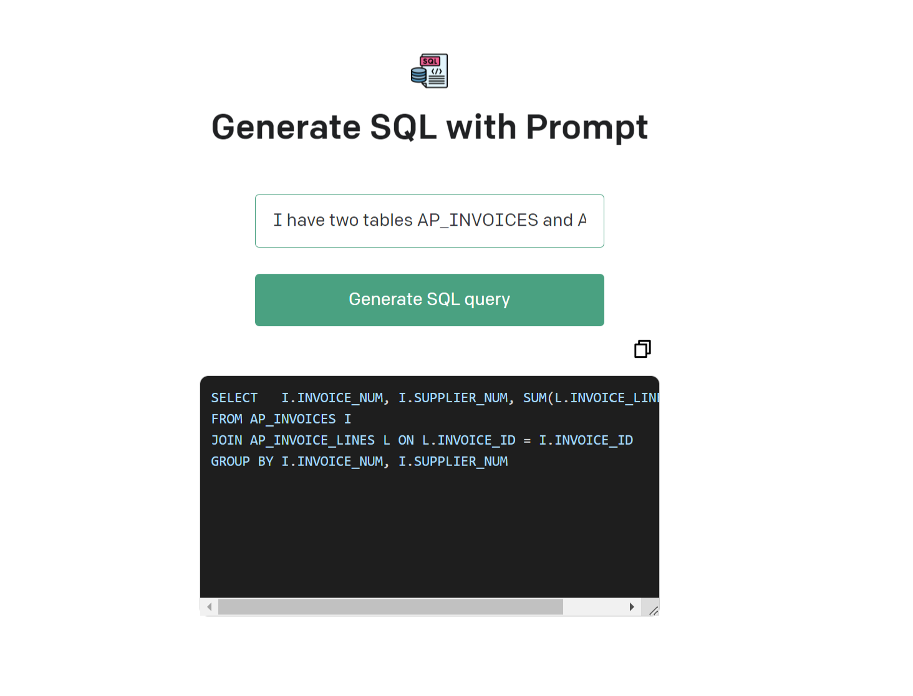
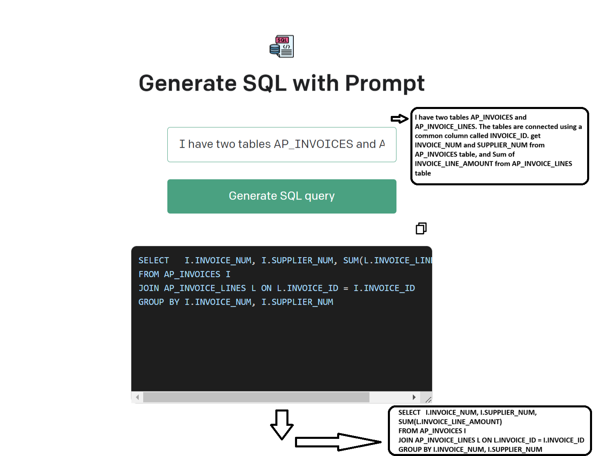

## Description

- NodeJs application with frontend and backennd APIa which leverages OpenAI LLM model to convert prompt to SQL query
- This Application could be integerated with any platform with database connection to have easy to generate complex sql queryies and fetching of data from SQL database

## Tech stack 

- LLM models
- OpenAI API
- Reactjs
- Nodejs

## App setup

- Run NPM install on both client and server folder
- Run NPM run in client
- Run NPM start in server
- Hit the client URL to visit the application
## Application UI:

## Application flow:

